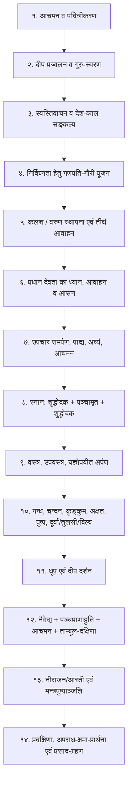

# ॐ श्री गणेशाय नमः | ॐ नमो नारायणाय

# अष्टादश (१८) पूजा-विधानों की शास्त्रीय समीक्षा एवं कर्मकाण्ड-मर्यादा

**स्थान:** `docs/pandit_jaanch/gemini/04_अष्टादश_पूजा_विधान_समीक्षा.md`  
**सम्बन्धित मूल फ़ोल्डर:** `पूजा/` (18 पूजा फ़ाइलें)  
**प्रमाण आधार:** धर्मसिन्धु, निर्णयसिन्धु, मत्स्यपुराण, स्कन्दपुराण, पारस्कर व आश्वलायन गृह्यसूत्र।

---

## १. सार्वभौम कर्मकाण्ड-क्रम (षोडशोपचार मर्यादा)

धर्मसिन्धु और निर्णयसिन्धु के अनुसार किसी भी प्रधान देव-पूजा का शास्त्रीय क्रम निम्नानुसार व्यवस्थित होना चाहिए:

---

## २. १८ पूजाओं का द्वि-स्तरीय व्यावहारिक वर्गीकरण

ऐप के उपयोगकर्ताओं की सुविधा और शास्त्रीय मर्यादा की रक्षा हेतु १८ पूजाओं को दो श्रेणियों में समझना अनिवार्य है:

### वर्ग 'क': गृहस्थ-साध्य सरल पूजाएँ (ऐप द्वारा मार्गदर्शन सम्भव)
1. **नित्य पूजा** (दैनिक ५-उपचार)
2. **सूर्य अर्घ्य** (दैनिक प्रातः अर्घ्य)
3. **तुलसी पूजा** (दैनिक सांध्य दीप व जल)
4. **गणेश पूजन** (सरल पञ्चोपचार/षोडशोपचार)
5. **हनुमान पूजा** (सिन्दूर, चोला, लड्डू)
6. **सरल शिव अभिषेक** (जलाभिषेक, बिल्वपत्र)
7. **राम / कृष्ण / सरस्वती पूजा**
8. **दीपावली लक्ष्मी-गणेश पूजन**
9. **करवा चौथ पूजन** (प्रादेशिक लोकाचार)
10. **वाहन पूजा** (नूतन वाहन तिलक व आरती)

### वर्ग 'ख': संस्कार एवं आचार्य-साध्य कर्म (`preparation_only` / `expert_assisted`)
1. **उपनयन (जनेऊ) संस्कार:** यज्ञोपवीत, सावित्री उपदेश, भिक्षाचरण केवल योग्य आचार्य द्वारा ही सम्भव हैं।
2. **श्राद्ध और तर्पण:** पितरों का पिण्डदान, तिलोदक, दक्षिणाभिमुख स्थिति बिना पण्डित के नहीं करानी चाहिए।
3. **मुण्डन (चूड़ाकर्म) संस्कार:** शिखा-स्थापन, वैदिक मन्त्रपूर्वक प्रथम लट काटना गृह्यसूत्र सम्मत कर्म है।
4. **गृह प्रवेश (पूर्ण वास्तु शान्ति):** वास्तु-मण्डल, नवग्रह, क्षीर-उफान, बलि-वैश्वदेव।
5. **सत्यनारायण व्रत-कथा:** यद्यपि कथा स्वयं पढ़ सकते हैं, पर पूर्ण पञ्चाङ्ग-पीठ व हवन हेतु पण्डित जी अपेक्षित हैं।

---

## ३. तकनीकी चेतावनी: कटी हुई पंक्तियाँ (120-अक्षर ट्रंकेशन)

वर्तमान में `पूजा/` की फ़ाइलों में जनरेटर स्क्रिप्ट के कारण १९७ में से **१०२ विवरण बीच में ही कटे हुए** हैं:
- **उदाहरण १ (`पूजा/नित्य_पूजा.md`):** *"…जल का लोटा भरकर पास रख लें ताकि बीच मे"* ➔ आगे का पाठ ग़ायब है।
- **उदाहरण २ (`पूजा/मुंडन_संस्कार.md`):** मन्त्र और नाई को निर्देश देने वाले वाक्य अधूरे हैं।
- **पण्डित-निर्णय:** जब तक `tools/banao_pandit_folder.py` से `[:120]` हटाकर पूर्ण फ़ोल्डर दोबारा जनरेट नहीं किया जाता, तब तक किसी भी पूजा विधि को अन्तिम रूप से "पास" नहीं माना जा सकता।

---

## ४. प्रमुख पूजा-विधानों की विशिष्ट शास्त्रीय टिप्पणियाँ

### १. सत्यनारायण पूजा (`पूजा/सत्यनारायण_पूजा.md`)
- **प्रसाद परिमाण:** सपाद (सवा) परिमाण (सवा सेर, सवा किलो, सवा पाव)।
- **तुलसीदल अनिवार्यता:** *"तुलसीदलहीनं तु यत्किञ्चित् क्रियते नरैः। न तत् गृह्णाति देवेशो..."* (पद्मपुराण)। विष्णु-भोग में तुलसी अनिवार्य है।

### २. सरल शिव अभिषेक (`पूजा/शिवरात्रि_और_सरल_शिव_अभिषेक.md`)
- **महत्वपूर्ण मर्यादा:** इसे "सरल शिव अभिषेक" ही कहें, "सम्पूर्ण लघुरुद्र" या "महारुद्र" न कहें।
- **निषेध:** शङ्ख से जल न चढ़ाएँ, तुलसीदल और केतकी पुष्प शिव पर सर्वथा वर्जित हैं। केवल जल, दुग्ध, भस्म, बिल्वपत्र और धतूरा ग्राह्य हैं।

### ३. करवा चौथ (`पूजा/करवा_चौथ_पूजन.md`)
- इसे शास्त्रोक्त वैदिक यज्ञ न मानकर **भविष्योत्तर-पुराणोक्त व्रतकथा** और उत्तर-भारतीय पवित्र नारी-परम्परा (लोकाचार) के रूप में प्रस्तुत करना यथार्थपरक है।

### ४. उपनयन एवं मुण्डन संस्कार
- ऐप में स्पष्ट चेतावनी होनी चाहिए: *"यह ऐप केवल संस्कार की सामग्री व तैयारी समझने हेतु है। मूल संस्कार योग्य वेदपाठी आचार्य की उपस्थिति में ही सम्पन्न करें।"*
